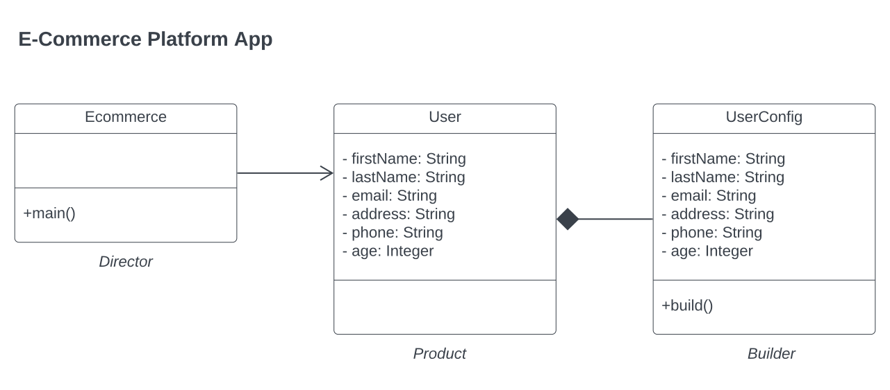
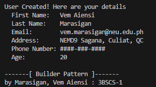

## Builder Pattern
> Marasigan, Vem Aiensi A.
>> 3BSCS-1 | CSL322-18

### Problem Scenario

Imagine you're developing an e-commerce application where customers create accounts with varying levels of detail.

Initially, you use a standard constructor for the User class:

```java
public User(String firstName, String lastName, String email,
           String address, String phone, int age) {
     // ...
}
```

However, you encounter challenges:

* Registration forms: It's cumbersome to ensure users enter all fields in the correct order, leading to errors and frustration.
* Optional fields: Not all customers provide complete information, but the constructor forces them to.
* Data consistency: Changes to user profiles after registration can cause unexpected issues due to mutable fields.

Implement solution using the Builder Pattern to address the issue.

### UML Diagram


### Sample Output



### Builder-pattern Code Preview
``` java

public class User {
    protected final String firtName;
    protected final String lastName;
    protected final String email;
    protected final String address;
    protected final String phone;
    protected final int age;

    private User(UserConfig builder){
        this.firtName = builder.firtName;
        this.lastName = builder.lastName;
        this.email = builder.email;
        this.address = builder.address;
        this.phone = builder.phone;
        this.age = builder.age;
    }

    protected static class UserConfig {
        private String firtName;
        private String lastName;
        private String email;
        private String address;
        private String phone;
        private int age;
    
        public UserConfig firstName(String firstName){
            this.firtName = firstName;
            return this;
        }
    
        public UserConfig lastName(String lastName){
            this.lastName = lastName;
            return this;
        }
    
        public UserConfig email(String email){
            this.email = email;
            return this;
        }
    
        public UserConfig address(String address){
            this.address = address;
            return this;
        }

        public UserConfig phone(String phone){
            this.phone = phone;
            return this;
        }

        public UserConfig age(int age){
            this.age = age;
            return this;
        }
        
        public User build(){
            return new User(this);
        }
    }
}
```

## <a href = "https://github.com/VemAiensi/SoftEng1/blob/main/RunCode/HowToRunCodeIntelliJ.md">HowToRun</a>
