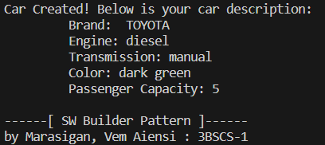

## SeatWork | Builder Pattern
> Marasigan, Vem Aiensi A.
>> 3BSCS-1 | CSL322-18

### Objective

Create implementing class CarAssemble  that will implement a builder class CarBuilder with regards to the attributes of a Car.  You need to include the brand, engine type (diesel or gasoline), tranmission (automatic or manual),  color, passenger capacity.


### Sample Output



### Builder-pattern Code Preview
``` java
public class Car 
{
    protected final String brand;
    protected final String engineType;
    protected final String transmission;
    protected final String color;
    protected final int passengerCapacity;

    private Car(CarBuilder builder)
    {
        this.brand = builder.brand;
        this.engineType = builder.engineType;
        this.transmission = builder.transmission;
        this.color = builder.color;
        this.passengerCapacity = builder.passengerCapacity;
    }


    public static class CarBuilder
    {
        private String brand;
        private String engineType;
        private String transmission;
        private String color;
        private int passengerCapacity;

        public CarBuilder brand(String brand)
        {
            this.brand = brand;
            return this;
        }

        public CarBuilder engineType(String engineType)
        {
            this.engineType = engineType;
            return this;
        }

        public CarBuilder transmission(String transmission)
        {
            this.transmission = transmission;
            return this;
        }

        public CarBuilder color(String color)
        {
            this.color = color;
            return this;
        }
        public CarBuilder passengerCapacity(int passengerCapacity)
        {
            this.passengerCapacity = passengerCapacity;
            return this;
        }
        public Car build()
        {
            return new Car(this);
        }
    }
    
}

```

