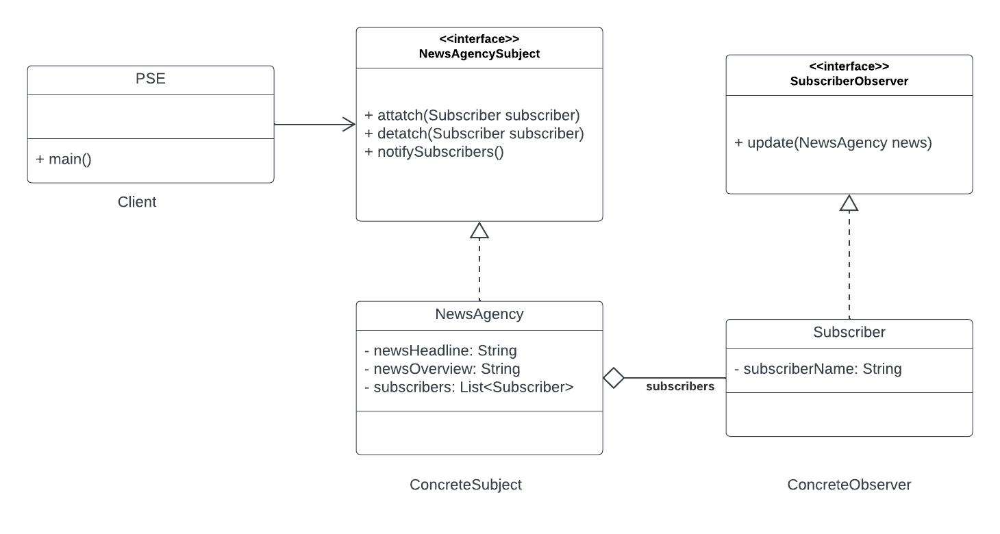
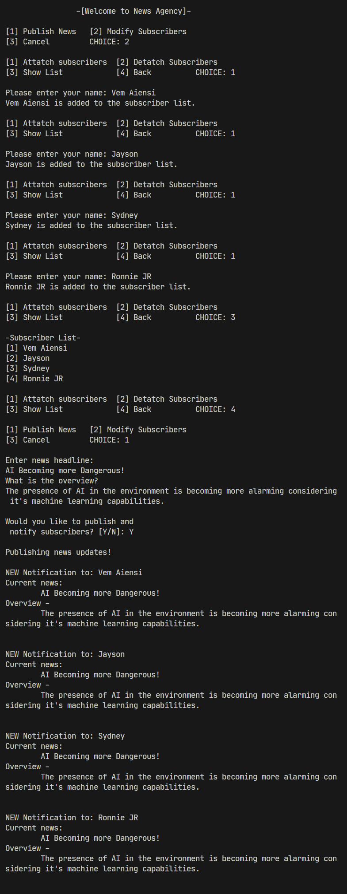
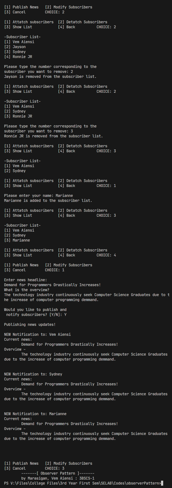

## LAB Assignment 8: Observer Pattern

Marasigan, Vem Aiensi A.  
3BSCS-1 | CSL311  

### Problem Statement

**Real-time News Subscription Service**

**Background:** You're tasked with designing a real-time news subscription service for a media company. The system needs to notify subscribers about breaking news as soon as it's published by the news agency.

**Scenario Description:** The system comprises two main components: _NewsAgency_ and _Subscriber_.

- **NewsAgency:** Represents the central hub for publishing news. It maintains a list of subscribers and notifies them whenever new news is available.

- **Subscriber:** Represents users or entities subscribed to the news service. Subscribers receive immediate notifications about any breaking news published by the agency.

**Requirements:**

1. **Subscription Management:**
   - Users should be able to subscribe to the news service.
   - Subscribers should be notified promptly when new news is published.
2. **Dynamic Subscription Updates:**
   - The system should allow for dynamic subscription updates. Subscribers can subscribe, unsubscribe, or modify their preferences without disrupting other subscribers.
3. **Decoupled Communication:**
   - Ensure that the communication between the news agency and subscribers is decoupled. Subscribers shouldn't directly request news updates but should be notified by the news agency when new information is available.

**Expected Behavior:**

- When the news agency publishes breaking news, all subscribed users should receive immediate updates.
- Subscribers can join or leave the service without affecting the delivery of news to other subscribers.
- The system should provide flexibility for future enhancements, such as personalized subscriptions or categorization of news updates.

**Constraints:**

- The system should be scalable to handle a growing number of subscribers without compromising performance.
- Ensure that the implementation follows object-oriented design principles and promotes loose coupling between the news agency and subscribers.

### UML Diagram

### Sample Output

### [How-To-Run](../0_RunCode/Readme.md)
