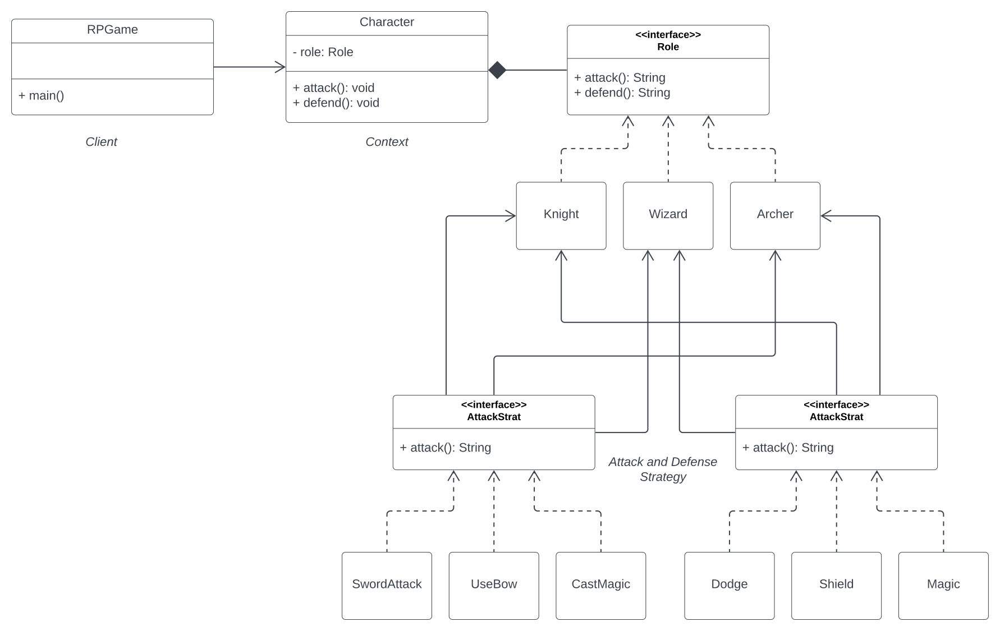
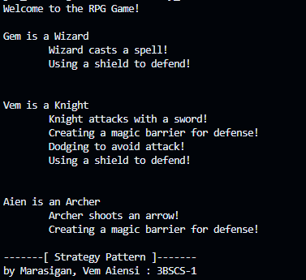

## Strategy Pattern
> Marasigan, Vem Aiensi A.
>> 3BSCS-1 | CSL322-18

### Problem Scenario

Suppose we have three types of characters in a GameApp:

1. Knight: Attacks with a sword; uses 3 strategies to defend (shield, dodge, magic barrier)
2. Wizard: Casts spells; uses magic barrier to defend
3. Archer: Shoots arrows; uses dodge to to defend

Implement two types of Strategy:

A.  DefenseStrategy

     1. Shield
     2. Dodge
     3. CreateMagic

B.  AttackStrategy

     1.  CastSpell
     2.  ShootArrow
     3.  SwingSword  


Refactor the existing codes:

```java
public class Character {
    private String type;

    public Character(String type) {
        this.type = type;
    }

    public void attack() {
        if (type.equals("Knight")) {
            System.out.println("Knight attacks with a sword!");
        } else if (type.equals("Wizard")) {
            System.out.println("Wizard casts a spell!");
        } else if (type.equals("Archer")) {
            System.out.println("Archer shoots an arrow!");
        }
    }

    public void defend() {
        if (type.equals("Knight")) {
            System.out.println("Using a shield to defend!");
	System.out.println("Dodgin to avoid attack!");
            System.out.println("Creating a magic barrier for defense!"");		

        } else if (type.equals("Wizard")) {
            System.out.println("Creating a magic barrier for defense!"");
        } else if (type.equals("Archer")) {
            System.out.println("Using a shield to defend!"");
        }
    }
}
```

```java
public User(String firstName, String lastName, String email,
           String address, String phone, int age) {
     // ...
}
```

However, you encounter challenges:

* Registration forms: It's cumbersome to ensure users enter all fields in the correct order, leading to errors and frustration.
* Optional fields: Not all customers provide complete information, but the constructor forces them to.
* Data consistency: Changes to user profiles after registration can cause unexpected issues due to mutable fields.

Implement solution using the Builder Pattern to address the issue.

### UML Diagram


### Sample Output



### Builder-pattern Code Preview
``` java

```

## <a href = "https://github.com/VemAiensi/SoftEng1/blob/main/RunCode/HowToRunCodeIntelliJ.md">HowToRun</a>
